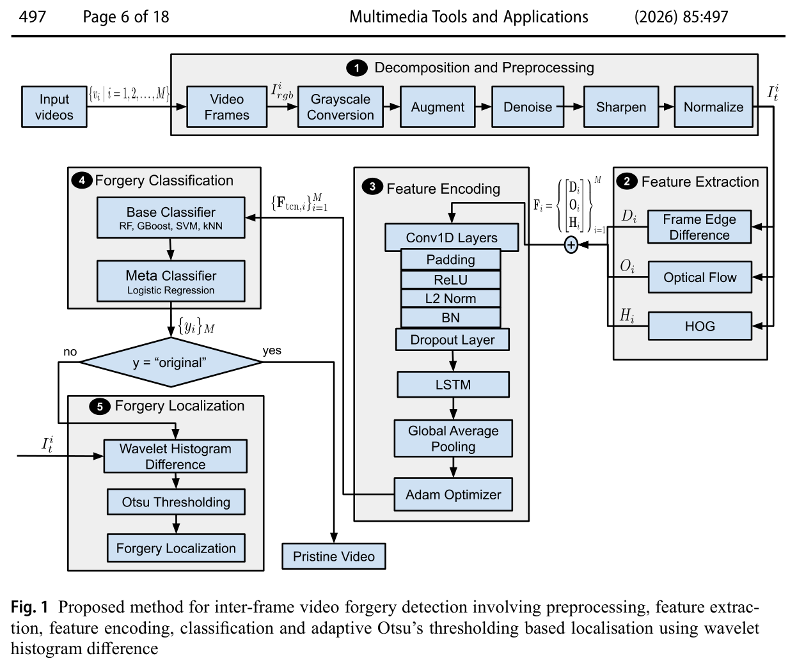

# Enhanced Inter-Frame Video Forgery Detection

<p align="center">
  <strong>Find manipulated frames in videos — insertion, deletion, and duplication</strong><br/>
  <em>Convolutional network + stacking ensemble · Multimedia Tools and Applications (2026)</em>
</p>

<p align="center">
  <a href="https://link.springer.com/article/10.1007/s11042-026-21684-x"></a>
  <a href="https://doi.org/10.1007/s11042-026-21684-x"></a>
  <a href="https://github.com/baheesa/inter_frame_forgery_detection"></a>
</p>

<p align="center">
  <!-- Empty <a> wrappers stop GitHub from opening the badge SVG on click -->
  <a></a>
  <a></a>
  <a></a>
  <a></a>
  <a></a>
</p>

---

## Why this exists

Video editors can quietly **insert**, **delete**, or **duplicate** frames — and that can hide or invent events in evidence. This project is the open implementation of our peer-reviewed method that spots those temporal forgeries in both static and dynamic clips.

It combines classical video cues (edges, motion, texture) with a temporal network and a stacking ensemble, then (in the full paper pipeline) localises *where* the tampering happened.

**Paper:** Fatima, B., Bakhshi, A.D. & Ghafoor, A. — [*Enhanced inter-frame video forgery detection using convolutional network and stacking ensemble*](https://link.springer.com/article/10.1007/s11042-026-21684-x). *Multimed Tools Appl* **85**, 497 (2026).

---

## What you get

| | Capability |
|---|---|
| :mag: | Detects **frame-insertion**, **frame-deletion**, **frame-duplication**, and **original** |
| :movie_camera: | Works on **static** and **dynamic** content |
| :jigsaw: | Handles **multiple** forgery sites in one video (paper evaluation) |
| :chart_with_upwards_trend: | Strong F1 on public sets — **0.994** VFD · **0.975** TDTVD · **0.940** VIFFD |

---

## How it works

The method follows five stages (paper Fig. 1). This repo covers annotation through classification; localisation is described in the paper (§2.2.5).

<p align="center">
  
</p>

<p align="center"><sub>Fig. 1 from the paper — preprocessing → features (D, O, H) → TCN encoding → stacking ensemble → wavelet ∆w + Otsu localisation.</sub></p>

<details>
<summary><strong>Stage cheat-sheet (plain language)</strong></summary>

<br/>

| Stage | Name | In simple terms |
|:-----:|------|-----------------|
| **1** | Preprocess | Clean frames: grayscale, denoise, sharpen, normalise (+ light augmentation) |
| **2** | Features | Pull three clues — **edge change (D)**, **optical flow (O)**, **HOG (H)** |
| **3** | TCN encode | Turn variable-length features into a fixed **64-D** temporal summary |
| **4** | Classify | Stacking ensemble: RF + GBoost + SVM + kNN → logistic regression |
| **5** | Localise | Wavelet histogram difference + Otsu to mark forged frame ranges |

</details>

---

## Quick start

### 1. Install

```bash
git clone https://github.com/baheesa/inter_frame_forgery_detection.git
cd inter_frame_forgery_detection

python -m venv .venv
source .venv/bin/activate          # Windows: .venv\Scripts\activate
pip install -r requirements.txt
```

### 2. Point scripts at your videos

Edit the paths in each script’s `main()` so they match your machine. Keep `split_data` the **same** in every script.

Suggested folder layout:

```text
<dataset_root>/
  original/     *.mp4 | *.avi | *.mov
  insert/
  delete/
  duplicate/
```

### 3. Run the pipeline (in order)

```bash
python annotate.py              # build annotation JSON
python preprocess_extract.py    # preprocess + extract D / O / H
python tcn_feat.py              # encode with TCN → 64-D vectors
python ensemble_class.py        # train & evaluate stacking ensemble
```

Outputs land under `output/` (annotations, features, `.npy` embeddings, trained model).

---

## What’s in the repo

```text
inter_frame_forgery_detection/
├── annotate.py               # label videos by folder class
├── preprocess_extract.py     # Stages 1–2
├── tcn_feat.py               # Stage 3
├── ensemble_class.py         # Stage 4
├── assets/method_diagram.png # paper Fig. 1
├── requirements.txt
└── README.md
```

| Script | Needs | Writes |
|--------|-------|--------|
| `annotate.py` | dataset folders | `output/annotations/*_annotate.json` |
| `preprocess_extract.py` | annotations | `output/*_preprocess_feat.json` |
| `tcn_feat.py` | preprocess JSON | `output/*_tcn.npy` |
| `ensemble_class.py` | annotations + TCN `.npy` | `stacking_model.pkl`, metrics, confusion plots |

Default train / val / test split in the ensemble step is about **60 / 20 / 20**.

---

## Datasets we used

| Dataset | Link | Snapshot |
|---------|------|----------|
| **VFD** | [Kaggle](https://www.kaggle.com/datasets/rajshah1/video-forgery--dataset) | 6176 videos · static & dynamic |
| **TDTVD** | [Paper / dataset](https://doi.org/10.1007/s11042-020-09205-w) | Temporal forgeries · single & multiple |
| **VIFFD** | [Mendeley](https://data.mendeley.com/) | Mostly static · multi-resolution |

In the paper, VIFFD and TDTVD were **balanced** with controlled synthesis from disjoint authentic seeds (no train/test leakage). See the article for the exact protocol.

---

## TCN snapshot (Stage 3)

| Setting | Value |
|---------|-------|
| Conv1D | 3 × 64 filters, kernel 2, causal, ReLU |
| Extras | Residuals · BatchNorm · Dropout 0.5 |
| LSTM | 2 × 64 |
| Output | Global average pooling → **64-D** |
| Train | Adam · MSE · **83,520** parameters |

---

## Results at a glance

Overall forgery detection (full pipeline, paper):

| Dataset | Score |
|---------|------:|
| VFD | **0.994** |
| TDTVD | **0.975** |
| VIFFD | **0.940** |

Ablation in the paper shows each piece (HOG, edges, flow, augmentation, TCN) helps; the full stack is strongest overall.

---

## Cite this work

If this code or method helps your research, please cite:

```bibtex
@article{Fatima2026InterFrame,
  title   = {Enhanced inter-frame video forgery detection using convolutional network and stacking ensemble},
  author  = {Fatima, Baheesa and Bakhshi, Asim Dilawar and Ghafoor, Abdul},
  journal = {Multimedia Tools and Applications},
  volume  = {85},
  number  = {497},
  year    = {2026},
  doi     = {10.1007/s11042-026-21684-x},
  url     = {https://link.springer.com/article/10.1007/s11042-026-21684-x}
}
```

---

## Team & contact

National University of Sciences and Technology (NUST), Islamabad, Pakistan

| | |
|---|---|
| **Baheesa Fatima** | Lead author · PhD scholar |
| **Asim Dilawar Bakhshi** | Corresponding author |
| **Abdul Ghafoor** | Co-author |

**Baheesa Fatima**

<p>
  <a href="mailto:baheesafatima@gmail.com"></a>
  <a href="mailto:bfatima.phdsemcs@student.nust.edu.pk"></a>
  <a href="https://www.linkedin.com/in/baheesafatima/"></a>
  <a href="https://www.researchgate.net/profile/Baheesa-Fatima-2"></a>
  <a href="https://orcid.org/0009-0003-2757-5672"></a>
</p>

- Email: [baheesafatima@gmail.com](mailto:baheesafatima@gmail.com) · [bfatima.phdsemcs@student.nust.edu.pk](mailto:bfatima.phdsemcs@student.nust.edu.pk)
- LinkedIn: [linkedin.com/in/baheesafatima](https://www.linkedin.com/in/baheesafatima/)
- ResearchGate: [researchgate.net/profile/Baheesa-Fatima](https://www.researchgate.net/profile/Baheesa-Fatima-2)
- ORCID: [0009-0003-2757-5672](https://orcid.org/0009-0003-2757-5672)

**Asim Dilawar Bakhshi** (corresponding) — [asim.dilawar@mcs.edu.pk](mailto:asim.dilawar@mcs.edu.pk)  
**Abdul Ghafoor** — [abdulghafoor-mcs@nust.edu.pk](mailto:abdulghafoor-mcs@nust.edu.pk)

---

## Licence & acknowledgements

### Code
This repository is shared to support **reproducibility** of the published article. You are welcome to use and adapt the code for academic research and education. If you build on it, please **cite the paper** (BibTeX above) and keep author attribution visible in derivative work.

### Paper text & figures
The article text, Fig. 1, and other figures remain under the Springer Nature publishing agreement. Fig. 1 is included here solely to document the method. For reuse outside this README, follow Springer / journal permissions.

### Datasets
[VFD](https://www.kaggle.com/datasets/rajshah1/video-forgery--dataset), [TDTVD](https://doi.org/10.1007/s11042-020-09205-w), and [VIFFD](https://data.mendeley.com/) belong to their original creators. Download and use them under each provider’s licence and citation rules — this repo does **not** redistribute the videos.

### Thanks
We thank NUST for research support, the dataset authors for releasing public benchmarks, and the editors and reviewers of *Multimedia Tools and Applications* for their feedback on the manuscript.

© 2026 Baheesa Fatima, Asim Dilawar Bakhshi, and Abdul Ghafoor.
